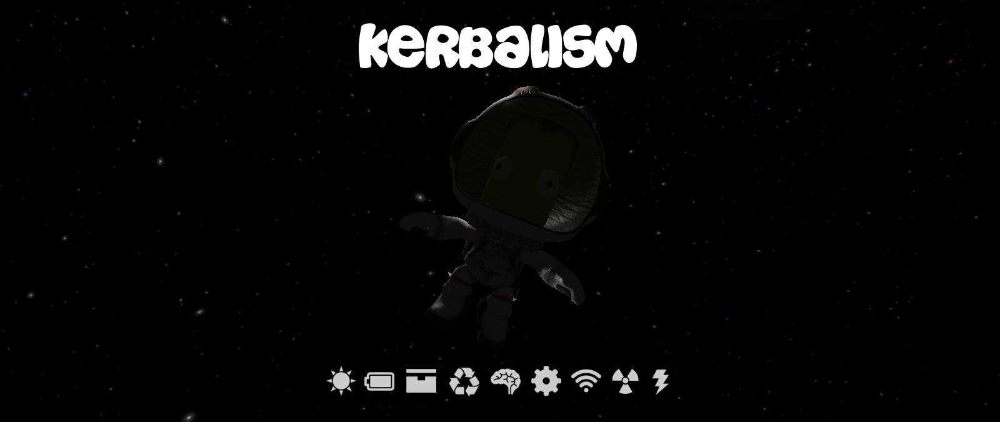

|Kerbalism|

Welcome to Kerbalism
====================
Hundreds of Kerbals were killed in the making of this mod.
----------------------------------------------------------

|docs| |build|

INTRODUCTION
------------
Go beyond the routine of orbital mechanics and experience the full set of engineering challenges that space has to
offer. This mod extends KSP by simulating the crew, components, resources and environment in a more complex way.
All mechanics can be configured to some degree, or even disabled if you don't like some of them. A big part of the
mod is fully data-driven, so that you can create your own customized game play with only a text editor and a
minimal amount of espresso. Or simply use the set of rules already included, or the ones shared by other users.
What follows is a summary description of the capabilities of the mod, and for a more detailed documentation the user
is invited to read the `Kerbalism documentation`_.

----------

ARCHITECTURE
------------
Contrary to popular belief, the observable universe is not a sphere of a 3km radius centered around the active vessel.
All mechanics are simulated for loaded and unloaded vessels alike, without exception. Acceptable performance was
obtained by a mix of smart approximations and common sense. The computational complexity is by and large independent
from the number of vessels.

----------

RESOURCES
---------
This isn't your classic post-facto resource simulation. Consumption and production work for all vessels, all the time,
and is coherent irregardless of warp speed or storage capacity. Complex chains of transformations just work. Enjoy
designing missions without the luxury of stopping the flow of time. No suspension of disbelief required.

----------

ENVIRONMENT
-----------
The environment of space is modeled in a simple yet effective way. Temperature is calculated using the direct solar
flux, the indirect solar flux bouncing off from celestial bodies, and the radiative infrared cooling of their surfaces.
The simulation of the latter is especially interesting, and contrary to popular models it is able to reproduce
satisfactory results for both atmospheric and atmospheric-less worlds. Radiation is implemented using an overlapping
hierarchy of 3D zones, modeled and rendered using signed distance fields. These are used to simulate inner and outer
belts, magnetosphere and even the heliopause. Solar weather is represented by Coronal Mass Ejection events, that
happen sporadically, increase radiation and cause communication blackouts.

----------

HABITAT
-------
The habitats of vessels are modeled in terms of internal volume, external surface, and a set of dedicated pseudo
resources. These elements are then used to calculate such things as: living space per-capita, the pressure, CO2 and humidity
levels of the internal atmosphere, and radiation shielding. Individual habitats can be enabled or disabled, in the
editor and in flight, to reconfigure the internal space and everything associated with it during the mission.
Inflatable habitats are driven directly by the part pressure.

----------

BIOLOGICAL NEEDS
----------------
Your crew need a constant intake of Food, Water and Oxygen. Failure to provide for these needs will result in
unceremonious death. Configurable supply containers are provided.

----------

PSYCHOLOGICAL NEEDS
-------------------
The era of tin can interplanetary travel is over. Your crew need some living space, however minimal. Failure to provide
enough living space will result in unforeseen events in the vessel, the kind that happen when operators lose
concentration. While not fatal directly, they often lead to fatal consequences later on. Some basic comforts can be
provided to delay the inevitable mental breakdown. Nothing fancy, just things like windows to look out, antennas to
call back home, or gravity rings to generate artificial gravity. Finally, recent research points out that living in a
pressurized environment is vastly superior to living in a suit. So bring some Nitrogen to compensate for leaks and keep
the internal atmosphere at an acceptable pressure.

----------

ENVIRONMENTAL HAZARDS
---------------------
Your crew evolved in particular conditions of temperature, and at a very low level of radiation. You should reproduce
these conditions wherever your crew go, no matter the external temperature or radiation at that point. Or else death
ensues. The vessel habitat can be climatized at the expense of ElectricCharge. Environment radiation can be shielded by
applying material layers to the hull, with obvious longevity vs mass trade off.

----------

ECLSS
-----
A set of ECLSS components is available for installation in any pod. The scrubber for example, that must be used to keep
the level of CO2 in the internal atmosphere below a threshold. Or the pressure control system, that can be used to
maintain a comfortable atmospheric pressure inside the vessel. In general, if you ever heard of some kind of apparatus
used by space agencies to keep the crew alive, you will find it in this mod.

----------

GREENHOUSE
----------
No life-support like mod would be complete without a greenhouse of some kind. The one included in this mod has a
relatively complete set of input resources and by-products, in addition to some more unique characteristics like a lamp
that adapts consumption to natural lighting, emergency harvesting, pressure requirements and radiation tolerance.

----------

ISRU
----
The stock ISRU converters can host a set of reality-inspired chemical processes. The emerging chains provide a flexible
and at the same time challenging system to keep your crew alive. The stock ISRU harvesters functionality has been
replaced with an equivalent one that is easier to plan against, as it is now vital for long-term manned missions. The
means to harvest from atmospheres and oceans is also present, given the importance of atmospheric resources in this regard.
A planetary resource distribution that mimics the real solar system completes the package.

----------

RELIABILITY
-----------
Components don't last forever in the real world. This is modeled by a simple system that can trigger failures on
arbitrary modules. Manufacturing quality can be chosen in the editor, per-component, and improve the MTBF but also
requires extra cost and mass. The crew can inspect and repair malfunctioned components. Redundancy now becomes a key aspect
of the design phase.

----------

SIGNAL
------
Transmission rates are realistic, and scale with distance to the point that it may take a long time to transmit data from
the outer solar system. Data transmission happens transparently in loaded and unloaded vessels. The resulting
communication system is simple, yet it also results in more realistic vessel and mission designs.

----------

SCIENCE
-------
Data is collected and stored in the vessel solid state drives, instead of the stock science containers. Moving data
around the vessel doesn't require extra vehicular activities. Some data can be transmitted back directly, while other
data needs to be analyzed in a lab first. Analyzing takes a long time, happens transparently to loaded and unloaded
vessels alike, and can't be cheated to create science out of thin air. An interesting method is used to bridge
existing stock and third-party experiments to the new science system, that works for most experiments without requiring
ad-hoc support.

----------

AUTOMATION
----------
Components can be automated using a minimalist scripting system, with a graphical editor. Scripts are triggered
manually or by environmental conditions. You can create a script to turn on all the lights as soon as the Sun is not
visible anymore, or retract all solar panels as soon as you enter an atmosphere etc.

----------

USER INTERFACE
--------------
The UI provided by this mod took more than 5 minutes to write. A planner UI is available in the editor, to help the
user design around all the new mechanics introduced. The planner analysis include resource estimates, habitat
informations, redundancy analysis, connectivity simulation, multi-environment radiation details and more. To monitor
the status of vessels, the monitor UI is also provided. This looks like a simple list of vessels at first, but just
click on it to discover an ingenuous little organizer that allow to watch vessel telemetry, control components, create
scripts, manage your science data including transmission and analysis, and configure the alerts per-vessel.

----------

MODULES EMULATION
-----------------
Most stock modules and some third-party ones are emulated for what concerns the mechanics introduced by the mod. The
level of support depends on the specific module, and may include: simulation of resource consumption and production in
unloaded vessels, fixing of timewarp issues in loaded vessels, the ability to disable the module after malfunctions,
and also the means to start and stop the module in an automation script.

----------

SUPPORTED MODS
--------------
Most mods work together with Kerbalism, others don't. Such is life. For a complete list of supported mods have a
look inside the `Support folder`_. Some of the interactions deserve a special mention though:

**SCANsat:**

- sensors consume EC in the background and their EC cost is evaluated by the planner
- sensors are shut down and restarted in background depending on EC availability

**RemoteTech:**

- antenna EC cost is evaluated by the planner
- failures will disable the antenna

**DeepFreeze:**

- all rules are suspended for hibernated Kerbals
- the vessel info window shows frozen Kerbals with a different color

**NearFuture:**

- curved solar panels, reactors, fission generators and RTGs produce EC in background and are evaluated by the planner

**PlanetaryBaseSystem:**

- the converters will work in the background and are evaluated by the planner

**OrbitalScience:**

- experiments data size has been tweaked for background data transmission

**OPM/RSS/NewHorizons:**

- custom radiation definitions for these planet packs are provided

----------

CONTRIBUTIONS
-------------
This project wouldn't have been possible without the contributions of an awesome community of people, too many to
mention individually. Thanks guys.

And special thanks to the artists that provided all the parts:

- mehka: Gravity ring
- Nazari1382: Geiger counter, small supply container
- tygoo7: Medium and big supply containers, radial pressurized container
- zzz: Greenhouse, active shield

----------

FAQs
----
There is a help file on GitHub for those wishing to report bugs or contribute to Kerbalism, see `CONTRIBUTING.md <CONTRIBUTING.md>`_

**I think I have found a bug, and I have just a few mods installed**

- Try to reproduce it consistently, then provide us with reproduction steps that demonstrates the issue. You may be asked to supply log files, screen shots and maybe a save game. Post the report on the `Kerbalism KSP forums thread`_, or raise an issue on `GitHub Kerbalism Issues`_.

**I want to add support for Kerbalism to my parts**

- Add the appropriate modules to your parts. Check the `Kerbalism documentation`_ for the module specifications.

**I want to interact with Kerbalism in my code**

- Have a look at the `System/API.cs <src/System/API.cs>`_ source code on GitHub. Raise an issue to request more functions.

----------

REQUIREMENTS
------------

- KSP 1.3.1 or 1.4.x
- Community Resource Pack (CRP)
- ModuleManager 3.0.0+

This mod includes version checking using MiniAVC_. If you opt-in, it will use the Internet to check whether there is a new version available. Data is only read from the Internet and no personal information is sent. For a more comprehensive version checking experience, please download the `KSP-AVC Plugin`_.

----------

LICENSE
-------
This mod is released under the `Unlicense <LICENSE>`_. For more information, please refer to `unlicense.org <http://unlicense.org>`_

.. _Support folder: https://github.com/steamp0rt/Kerbalism/tree/master/GameData/Kerbalism/Support
.. _Kerbalism KSP forums thread: https://forum.kerbalspaceprogram.com/index.php?/topic/172400-131144-kerbalism-v171/
.. _GitHub Kerbalism Issues: https://github.com/steamp0rt/Kerbalism/issues
.. _Kerbalism documentation: https://kerbalism.readthedocs.io/en/latest/

.. _MiniAVC: https://ksp.cybutek.net/miniavc/Documents/README.htm
.. _KSP-AVC Plugin: https://forum.kerbalspaceprogram.com/index.php?/topic/72169-13-12-ksp-avc-add-on-version-checker-plugin-1162-miniavc-ksp-avc-online-2016-10-13/

.. |docs| image:: https://readthedocs.org/projects/kerbalism/badge/?version=latest&style=flat-square
    :alt: Documentation Status
    :scale: 100%
    :target: https://kerbalism.readthedocs.io/en/latest/?badge=latest

.. |build| image:: https://img.shields.io/travis-ci/com/steamp0rt/Kerbalism.svg?style=flat-square&branch=master)](https://travis-ci.org/steamp0rt/Kerbalism
    :alt: Build Status
    :scale: 100%
    :target: https://travis-ci\.com/steamp0rt/Kerbalism
