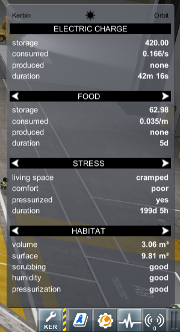
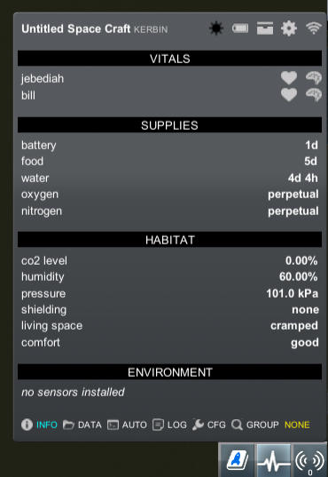

.. _gui:

Graphics User Interface (GUI)
=============================

Planner
-------
A planner is provided in the editors to help design around the mechanics introduced in Kerbalism.

The calculations are done relative to a target body and situation, whether a star is visible or occluded and considering the number of crew currently assigned to the vessel (keep ALT pressed to consider the whole vessel crew capacity instead).

Target body, situation and whether in shadow or not can be changed by clicking on the relative icon in the planner title bar.

Hover the mouse over an entry to show related tooltips with explanations and additional information.

----------

Monitor
-------
The *vessel monitor* is available in the space center, the tracking station and in flight. It shows the state of your vessels and the Kerbals inside them.

The monitor will show a list of vessels, and a summary of its state represented with indicator icons.

From left to right:

- vessel name
- body name
- problem icons
- battery level
- supplies level
- reliability status
- signal status

Clicking on a vessel in the list will select it. The monitor will then show a panel about the vessel. Right-clicking anywhere in the monitor will de-select the vessel and return back to the vessel list view.

In the vessel details view, select what panel to display by left-clicking on the bottom menu entries. Middle-click on the menu entries instead to popout the panel as a window.

**Groups and Filtering**

The last bottom menu button in *vessel details* allows you to see and change the *group* a vessel is assigned to. When at least one of the vessels is assigned to a group, the *filter bar* will appear at the bottom of the monitor. Click on it and type a group to hide all vessels except the members of that group.

.. image:: ../misc/img/gui/monitor-filter.gif

**Problem icons**

+--------------------+----------------------------------+
| |sun-black|        | Vessel is not in direct sunlight |
+--------------------+----------------------------------+
| |storm-yellow|     | Solar storm inbound              |
+--------------------+----------------------------------+
| |storm-red|        | Solar storm in progress          |
+--------------------+----------------------------------+
| |radiation-yellow| | Exposed to intense radiation     |
+--------------------+----------------------------------+
| |radiation-red|    | Exposed to extreme radiation     |
+--------------------+----------------------------------+
| |health-yellow|    | Kerbal doesn't feel well         |
+--------------------+----------------------------------+
| |health-red|       | Kerbal is about to die           |
+--------------------+----------------------------------+
| |brain-yellow|     | Kerbal is stressed               |
+--------------------+----------------------------------+
| |brain-red|        | Kerbal is breaking down          |
+--------------------+----------------------------------+
| |recycle-yellow|   | CO2 level is above warning level |
+--------------------+----------------------------------+
| |recycle-red|      | CO2 level is above danger level  |
+--------------------+----------------------------------+
| |plant-yellow|     | Greenhouse is not growing        |
+--------------------+----------------------------------+

**Battery icon**

+---------------------+------------------------------------------+
| |battery-white|     | *ElectricCharge* above warning threshold |
+---------------------+------------------------------------------+
| |battery-yellow|    | *ElectricCharge* below warning threshold |
+---------------------+------------------------------------------+
| |battery-red|       | *ElectricCharge* is depleted             |
+---------------------+------------------------------------------+

**Supply icon**

+---------------------+--------------------------------------------+
| |box-white|         | *Supply resources* above warning threshold |
+---------------------+--------------------------------------------+
| |box-yellow|        | *Supply resources* below warning threshold |
+---------------------+--------------------------------------------+
| |box-red|           | *Supply resources* are depleted            |
+---------------------+--------------------------------------------+

**Reliability icon**

+------------------------+----------------------------------+
| |wrench-white|         | No failures                      |
+------------------------+----------------------------------+
| |wrench-yellow|        | One or more *malfunctions*       |
+------------------------+----------------------------------+
| |wrench-red|           | One or more *critical failures*  |
+------------------------+----------------------------------+

**Signal icon**

+--------------------+--------------------------------+
| |signal-white|     | Transmission rate above 5Kbps  |
+--------------------+--------------------------------+
| |signal-yellow|    | Transmission rate below 5Kbps  |
+--------------------+--------------------------------+
| |signal-red|       | No signal / Blackout           |
+--------------------+--------------------------------+

----------

Telemetry
---------
This panel shows readings from the vessel, including crew vitals, resource supply levels, habitat and environmental information. 

----------

File manager
------------
This panel allows you to visualize files stored in the vessels hard drive, flag them for transmission or analysis, or delete them. Hovering over a file will display a tooltip with additional information.

.. image:: ../misc/img/gui/file-manager.png

----------

Device manager
--------------
This panel will show the control status of all components in a vessel, it is also used as the editor for the `automation <automation.html>`_ scripts.

.. image:: ../misc/img/gui/dev-manager.png

----------

Configuration manager
---------------------
This panel allows you to set what messages will be shown for the vessel.

.. image:: ../misc/img/gui/config-man.png

----------

Body info
---------
When in the tracking station or map view, press **B** to open the *body info window*. Here some information is shown about the body atmosphere and radiation environment, also the rendering of the radiation fields can be controlled here.

.. image:: ../misc/img/gui/body-info.png

.. |sun-black| image:: ../GameData/Kerbalism/Textures/sun-black.png
.. |storm-yellow| image:: ../GameData/Kerbalism/Textures/storm-yellow.png
.. |storm-red| image:: ../GameData/Kerbalism/Textures/storm-red.png
.. |radiation-yellow| image:: ../GameData/Kerbalism/Textures/radiation-yellow.png
.. |radiation-red| image:: ../GameData/Kerbalism/Textures/radiation-red.png
.. |health-yellow| image:: ../GameData/Kerbalism/Textures/health-yellow.png
.. |health-red| image:: ../GameData/Kerbalism/Textures/health-red.png
.. |brain-yellow| image:: ../GameData/Kerbalism/Textures/brain-yellow.png
.. |brain-red| image:: ../GameData/Kerbalism/Textures/brain-red.png
.. |recycle-yellow| image:: ../GameData/Kerbalism/Textures/recycle-yellow.png
.. |recycle-red| image:: ../GameData/Kerbalism/Textures/recycle-red.png
.. |plant-yellow| image:: ../GameData/Kerbalism/Textures/plant-yellow.png

.. |battery-white| image:: ../GameData/Kerbalism/Textures/battery-white.png
.. |battery-yellow| image:: ../GameData/Kerbalism/Textures/battery-yellow.png
.. |battery-red| image:: ../GameData/Kerbalism/Textures/battery-red.png

.. |box-white| image:: ../GameData/Kerbalism/Textures/box-white.png
.. |box-yellow| image:: ../GameData/Kerbalism/Textures/box-yellow.png
.. |box-red| image:: ../GameData/Kerbalism/Textures/box-red.png

.. |wrench-white| image:: ../GameData/Kerbalism/Textures/wrench-white.png
.. |wrench-yellow| image:: ../GameData/Kerbalism/Textures/wrench-yellow.png
.. |wrench-red| image:: ../GameData/Kerbalism/Textures/wrench-red.png

.. |signal-white| image:: ../GameData/Kerbalism/Textures/signal-white.png
.. |signal-yellow| image:: ../GameData/Kerbalism/Textures/signal-yellow.png
.. |signal-red| image:: ../GameData/Kerbalism/Textures/signal-red.png
