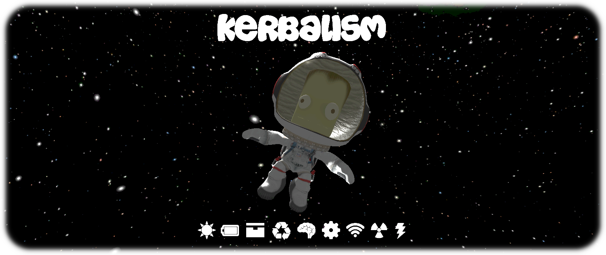

---
hide:
  - navigation
---

Kerbalism 是《坎巴拉太空计划》的模组：生命维持、辐射、故障，外加一套和原版完全不同的科研玩法。

它把轨道力学之外的工程也拽进游戏——乘员、部件、资源、太空环境，都会被更认真地算一遍。几乎所有机制都能改，甚至整段关掉。大量内容是数据驱动的：一台文本编辑器，再来杯咖啡，就能捣鼓出自己的规则集；嫌麻烦的话，直接用官方或社区现成的配置也行。

## 所有飞船，始终在线

可观测宇宙可不是围着当前飞船画的 3 km 小球。船在场景里也好、扔后台也好，该模拟的 Kerbalism 都会接着算。靠合理的近似和取舍，性能大体不跟飞船数量一起爆炸。

## 资源

这不是「卸载了再事后补算」的资源系统。时间加速多狠、罐子多小，消耗和产出都前后对齐。你为长期生命维持或采矿基地搭的复杂转化链，卸载之后照样转。

## 环境

太空环境用简洁但够用的方式建模：温度来自直射太阳、天体反射，以及表面红外冷却。

后者特别适合拉出「有大气 / 没大气」的温差。辐射用重叠的三维区域（符号距离场）描述内带、外带、磁层，一路到日球层顶。太阳天气用日冕物质抛射（CME）表示——抬高辐射，顺便还能把通信掐断。

## 居住舱

飞船居住区按内部体积、外表面，以及一组专用伪资源建模，用来算人均生活空间、气压、二氧化碳、辐射屏蔽等。组装厂和飞行中都能单独开关某个居住模块，任务中途重组舱内布局。充气舱直接由舱内压力驱动。

## 生命维持

乘员要持续的食物、水和氧气；断供就会死。模组提供可配置的补给容器。

Kerbal 适应特定温度和极低辐射。舱外再怎么折腾，你都得在舱内复现这些条件，否则就是要命。舱内空调吃电；船体可以敷屏蔽层——寿命和质量，自己权衡。

## 心理需求

罐头船时代结束了。乘员需要最起码的生活空间，否则会因注意力崩溃引发事故——不一定当场致命，却常常把后续灾难的引信点着。窗户、天线、重力环这类基本舒适设施，能把崩溃往后推。加压环境也远好过长期裹在舱外服里：记得带氮气，补泄漏、撑气压。

## ECLSS

任意指令舱都能塞一套环境控制与生命维持（ECLSS）组件，比如清二氧化碳的洗涤器，或维持舒适气压的压力控制。现实航天机构用来保命的那些玩意儿，这里大多能找到对应物。

## ISRU

原版 ISRU 转换器可以承载一套更贴近现实的化学流程；采掘也更利于长期载人任务。大气与海洋采集同样重要。温室有较完整的输入 / 副产品模型，约束满足时持续产出 Food，还带随自然光照调节的灯，以及气压与辐射耐受等。行星资源分布则尽量往真实太阳系靠。

## 可靠性

部件不会永远听话。故障可以打在任意模块上；制造质量在组装厂里按部件选——MTBF 上去的同时，成本和质量也上去。乘员可以检查、修理故障部件。于是冗余成了设计核心，而不是锦上添花。

## 科研

实验不再一键吐科学点，而要花时间跑——有的几分钟，有的数月。未加载飞船上也会后台继续。

数据和样品是两类结果：读数可以传；样品得回收，或经实验室分析后才能传。传输速率随距离衰减；船在不在场景里，通信都照样处理。

## 自动化

用极简脚本系统（含图形编辑器）自动化组件，可手动触发，也可跟环境挂钩——比如日落后开灯、进大气时收太阳能板。

## 用户界面

组装厂里有规划器，帮你围着新机制造船；监控界面可在各场景看遥测、拨组件、写脚本、管科研数据和警报。

## 模块仿真

对原版和部分第三方模块，Kerbalism 会在资源、时间加速、故障与自动化等方面做仿真或修补；支持到什么程度，因模块而异。
