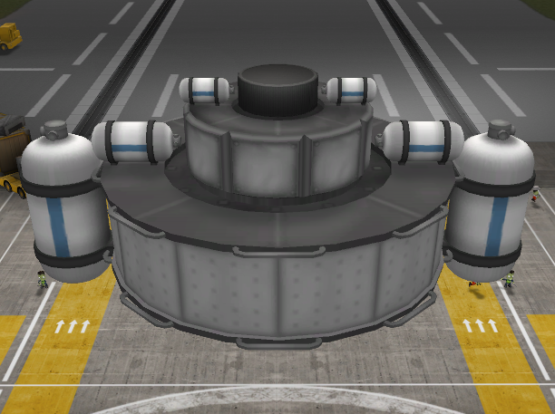
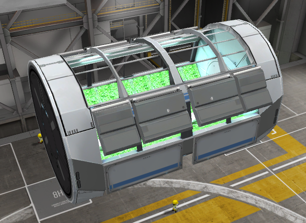
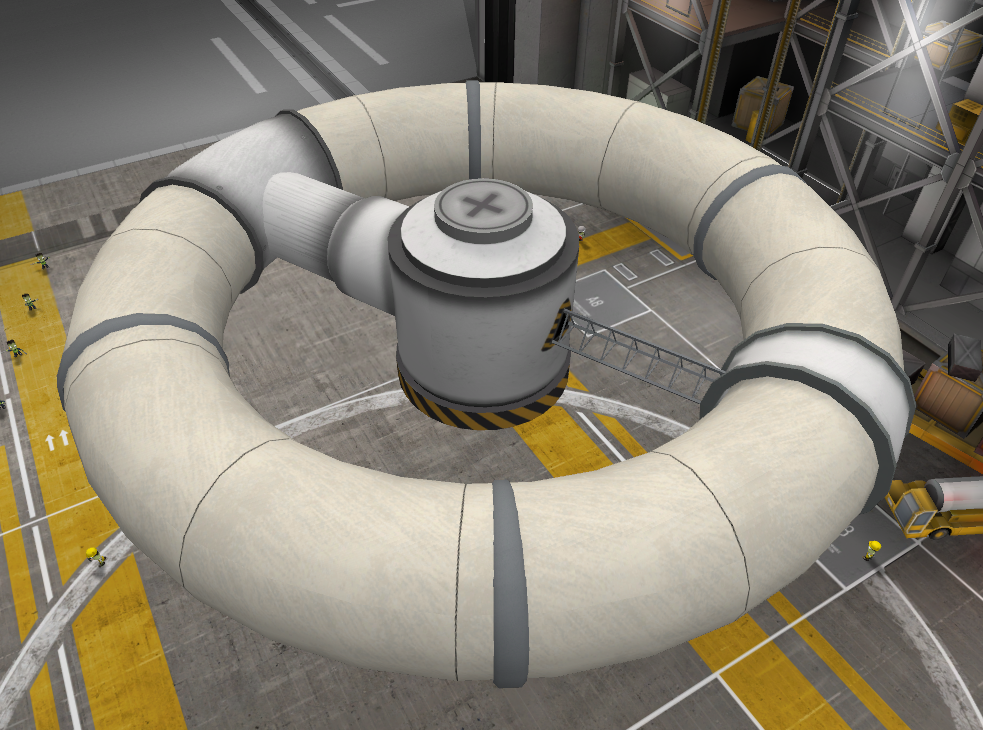
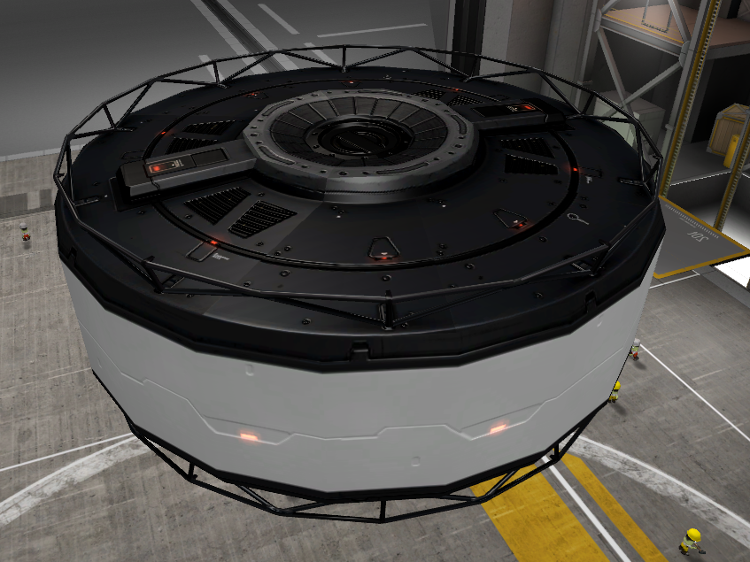
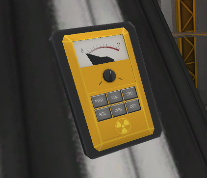
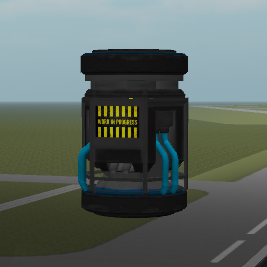
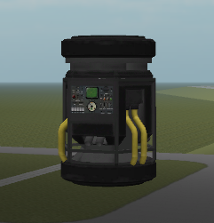
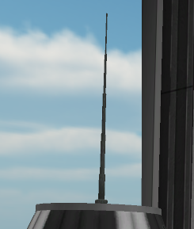

.. _parts:

Kerbalism's Parts
=================

Containers
----------

A set of supply `resource <resources.html#containers>`_ containers.

|
|
|
|

----------

Greenhouse
----------

A `greenhouse <kerbals.html#greenhouse>`_.

|
|
|
|

----------

Gravity Ring
------------

A rotating ring inflatable habitat.

|
|
|
|

----------

Active Shield
-------------

A late-game active radiation shield.

|
|
|
|

----------

Geiger Counter
--------------

An environment radiation sensor.

|
|
|
|

----------

ECLSS Unit
----------

An External Life Support System (`ECLSS <kerbals.html#lss>`_).

|
|
|
|

----------

Chemical Plant
--------------

A very small `ISRU <resources.html#isru>`_ plant.

|
|
|
|

----------

Short Antenna
-------------

A small antenna.
