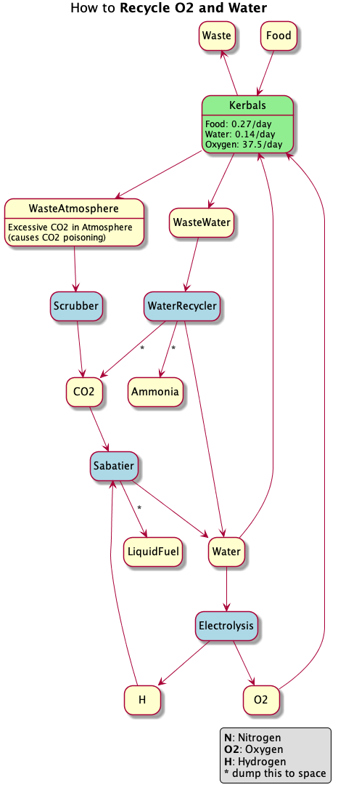

## 这就要飞 Mun 了？

Kerbalism 大概给乘员多准备了六种死法。第一次开着它登 Mun 的话，先把这篇读完——或者，记得带尸袋。说了啊，别怪我没提醒。

## 出发前……

假设你刚开一局生涯，正准备第一次载人登 Mun。组装厂和发射台还没扩建，飞船顶多 30 个零件、18 吨。这种配置下登 Mun 本来就不轻松；再套上 Kerbalism，就算你以前飞过无数次 Mun，也得重新当新手。

想活着回来，整趟任务都得备足食物、水和氧气。指挥舱自带的补给大概能撑 **5 天**——刚好够一次「打个卡就走」的 Mun 任务（飞掠，或者点一下地就撤）。再久就得自己加货。所以现在只盯着 Mun，别在上面晃悠超过几小时。Minmus？先别想。敢跑偏，乘员会死于各种原因——饿死只是其中最体面的一种。

载人船上，氧气之后最要命的是电。没电，乘员不是闷死、冻死，就是热死，看谁手快。空调挂了、船快被太阳烤焦的时候，你会发现「没吃的」根本排不上号。所以，先把电搞定。

## 最低配置

得有靠谱的发电手段。太阳能板或燃料电池还没研究？先去点科技。发不出电就别登 Mun，真的。

尽量别只靠太阳能，带一台燃料电池。经验法则：燃料电池保命，越早养成习惯越好。太阳能板得看见太阳——而你的任务里，有一大段时间会泡在阴影里。

## 造船

走燃料电池路线的话（推荐），装一台 H2+O2（氢+氧）燃料电池。再挂一个加压罐装 **氢**（默认往往是氧，记得到 VAB 里改配置）；有余力再加一罐氧。燃料电池开着会吃氢和氧——可能把乘员呼吸用的氧气也顺手喝光。太阳能板能减轻这对资源的消耗。

H2+O2 燃料电池还会产水。Kerbalism 有个坏脾气：产物既存不下又不能倾倒时，流程直接罢工。所以把燃料电池设成「多余的水倒掉」。飞行中也能改，VAB 忘了也别慌。多出来的水以后乘员会喝掉，通常不算事。

## 发射窗口

没带燃料电池的话，先确认任务期间 Mun 不会钻进 Kerbin 的影子再打。新开一局时，Mun 往往正要转到 Kerbin 背后——先晾几天再发射。不然乘员会在阴影里冻成冰棍。

## 点火前一刻

有燃料电池时，一般不想让它全天候狂转。Kerbalism 自带设备管理器：电池见底就开燃料电池，充饱再关。再配上太阳能，能省下大量氢和氧。

## 然后呢？

发射！双手合十，祈祷氧气、食物、水、电、氢里至少有一样能撑到你从 Mun 飞回来。

下一站才是 Minmus，耗时明显更长。按大约 **20 天** 备货，再多塞一两个氧气罐，心里踏实。

# 氧气和水怎么循环

靠 Kerbalism 的生命维持和化工厂，可以把氧气和水「转」起来。照着做，任务能拉得很长，还能省下成吨本来要扛上天的质量。

1. 加一个小废水罐。
2. 在生命维持单元里装水回收器，并设为倾倒多余的二氧化碳和氨。
3. 加一个小氢罐和一个小二氧化碳罐。空着也行，氢最好先灌满。
4. 化工厂跑萨巴蒂埃过程（Sabatier），多余液体燃料直接倒掉。
5. 再让化工厂跑水电解。

这套很省质量，也很要命：你平白多出三个会坏的环节，任何一个修不了，乘员就会把罐里那点氧气啃光，然后安静地离开我们。上这套方案时，冗余不是可选项。

