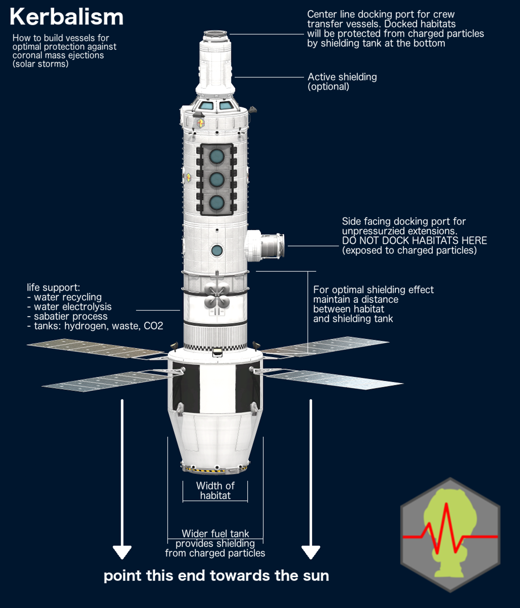

Temperature
-----------
Temperatures in space range from ridiculously low to extremely high. The temperature model in Kerbalism considers

- [Solar irradiance](https://en.wikipedia.org/wiki/Solar_irradiance) *(the energy flux coming from a star, if not occluded)*
- [Albedo irradiance](https://en.wikipedia.org/wiki/Albedo) *(the energy flux reflected from a celestial body towards a vessel)*
- [Body irradiance](https://en.wikipedia.org/wiki/Radiative_cooling) *(the radiative cooling flux from a nearby celestial body)*
- [Cosmic background irradiance](https://en.wikipedia.org/wiki/Cosmic_microwave_background)

The temperature is then obtained according to the [Stefan-Boltzmann law](https://en.wikipedia.org/wiki/Stefan%E2%80%93Boltzmann_law) assuming the vessel is a perfect [black body](https://en.wikipedia.org/wiki/Black_body). Inside an atmosphere, the stock atmospheric temperature model is used instead.

Radiation
---------
Celestial bodies interact in complex ways with radiation. Some have a magnetopause that shields radiation, others have radiation belts that are populated by extremely charged particles. Bodies can be radioactive and emit gamma radiation from the surface, and suns usually have cycles of varying degrees of radiation activity.

This is modeled with *radiation fields*, regions of space around a celestial body that have an associated radiation level. The overall radiation level for a vessel is determined by evaluating all the fields overlapping at the vessel position.

These fields are rendered in map view or the tracking station. They can be toggled by pressing *Keypad 0/1/2/3*, or by using the *Body Info* window.

Radiation Models can be modified, see the "Modding Kerbalism's Radiation Models" section for more details.

Coronal Mass Ejection (CME)
---------------------------
[Coronal Mass Ejection](https://en.wikipedia.org/wiki/Coronal_mass_ejection) events are generated in a stars corona, and move toward either a planetary system or a star-orbiting vessel. A warning will be issued as soon as a relevant CME event is detected that will hit any vessel. When the CME hits, all vessels in direct line of sight of the star will receive extra radiation. Vessels inside of a magnetopause will suffer a communications *blackout*. The effects last for some time until the situation returns to normality.

Frequency and intensity of CME events depends on the current level of solar activity, which again changes over time according to a solar cycle duration. So does the surface radiation emitted by the sun, if there is any. One way to avoid CME events on interplanetary trips is to plan those trips during a time with little solar activity, which goes from low to high and back in a roughly 11 year cycle.

During a CME event it is advisable to take extra care for all affected vessels with crew. For best protection, orient the vessel in such a way that the crew habitats are shielded from the sun by other parts of the vessel, like engines or big tanks. The bigger the mass, the better the shielding. This will reduce some of the particle radiation, but it also will generate [bremsstrahlung](https://en.wikipedia.org/wiki/Bremsstrahlung) in the form of gamma rays. For optimal results, place a very heavy part at the biggest possible distance away from the crew compartements. You might want to consider this when designing vessels for crewed missions outside a magnetopause.

During phases of high solar activity, try to limit EVA missions to a minimum, and try to stay in the shadow.

Radioactive parts
-----------------
Some parts are active radioactive emitters, like NERV engines, nuclear reactors or RTG batteries. Place them well away from any crewed compartements to limit radiation poisoning, and stay well away from them on all EVA activities. Distance is the best shielding, and you don't have any other!