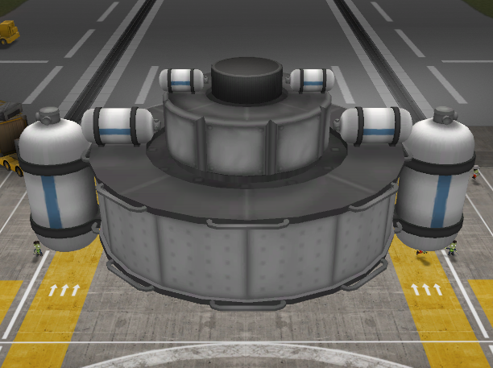
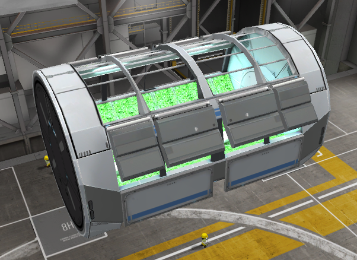
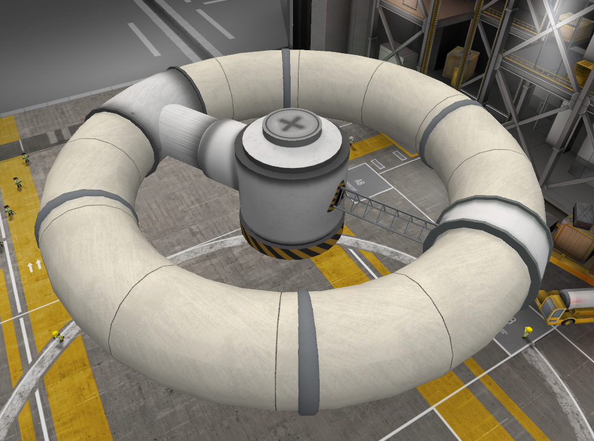
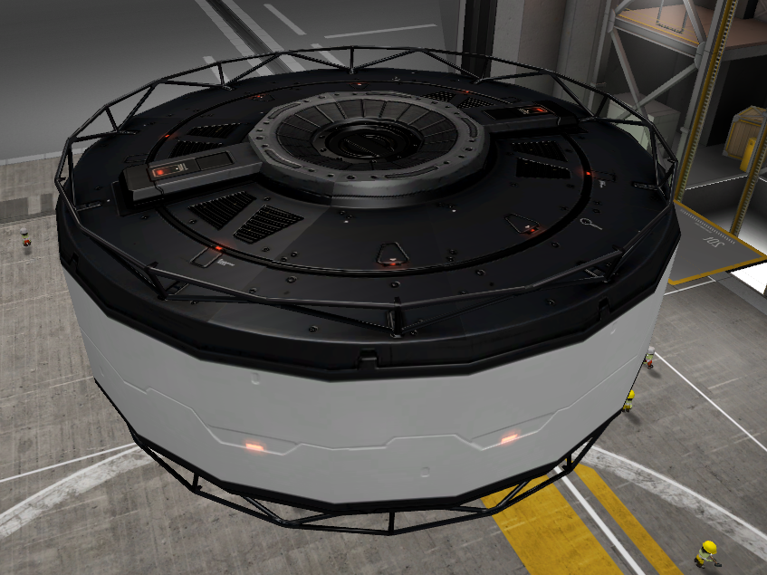
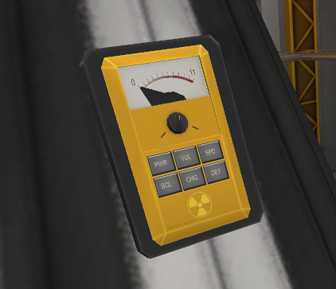
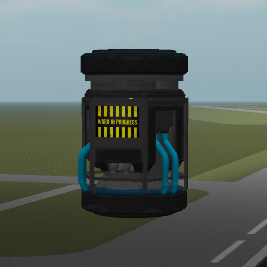
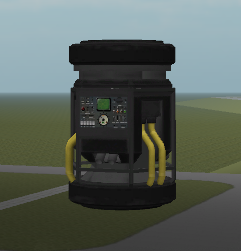
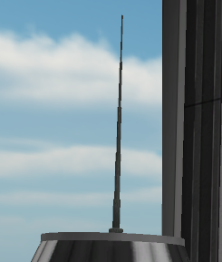

## 容器

一套补给资源容器。

## 温室

持续生产与质量盈亏见 [温室质量平衡](greenhouse-balance.md)。

## 重力环

可旋转的充气栖息地环。有电且已展开时，整船获得坚实地面舒适度。不用这个部件也可以靠整船自旋达成——见 [栖息地 → 舒适度](habitat.md)。

## 主动屏蔽

后期用的主动辐射屏蔽。

## 盖革计数器

环境辐射传感器。

## ECLSS 单元

外部生命维持系统。

## 化工厂

很小的 ISRU / 转换装置。

## 短天线

小型天线。
