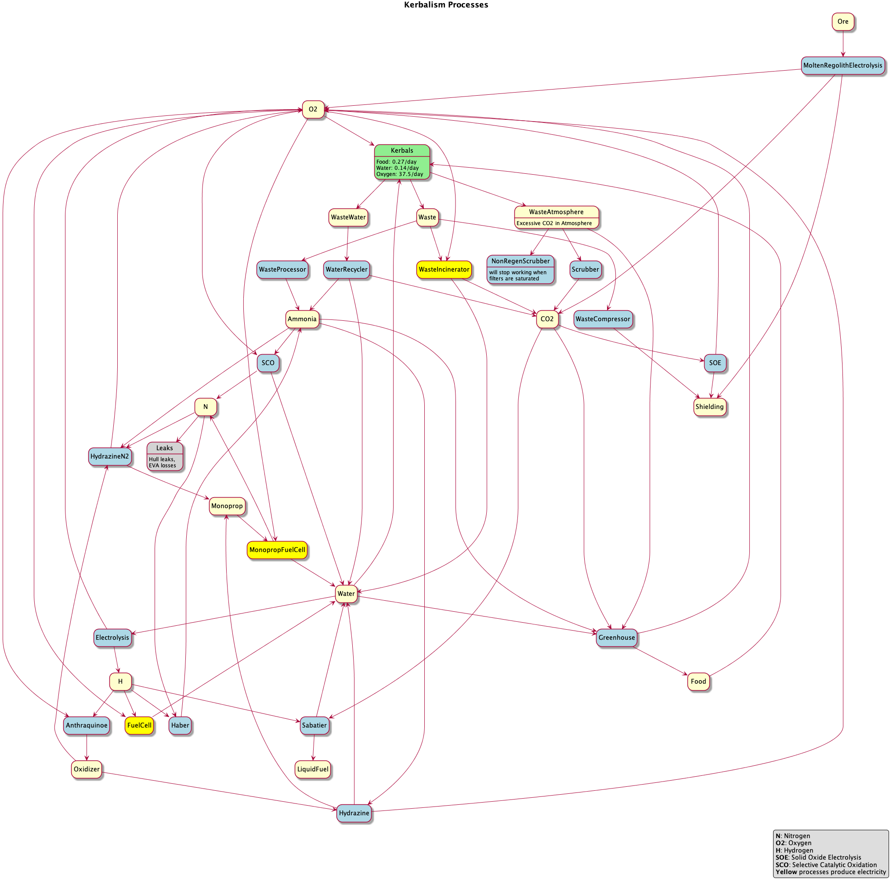
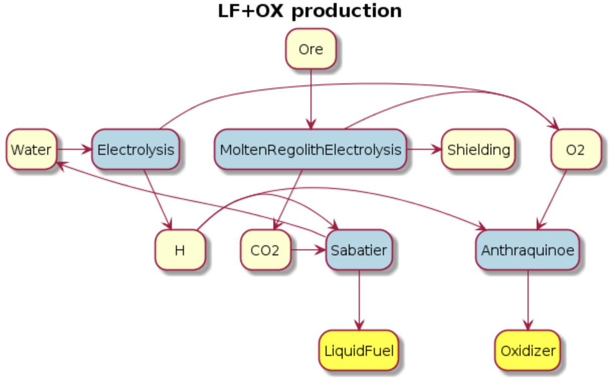

## 概览

Kerbalism 里流程不少，能玩出各种组合。下图帮你理清资源和转化关系。

## 容器

容器在组装厂里配置。直列补给容器可以装：

- 食物 + 水（补给）
- 仅食物
- 仅水
- 废物 + 废水（污水）
- 仅废物
- 仅废水

径向加压容器可以装：

- 氧气、氮气、氢气、氨、二氧化碳、氙

## ISRU

可配置 ISRU 执行一组化学流程，在组装厂选定。缺输入，或输出没地方放，流程就会停。输出装不下时，可以用 Dump 把多余的倒掉，好让流程接着跑。

流程里几种推进剂的化学对应是：

- LiquidFuel ≈ 甲烷 CH₄
- Oxidizer ≈ 过氧化氢 H₂O₂
- MonoPropellant ≈ 肼 N₂H₄

| 化学流程 | 输入 | 输出 | 所需科技 |
| --- | --- | --- | --- |
| 水电解 | EC, Water | Hydrogen, Oxygen |  |
| 萨巴蒂埃过程 | EC, CO2, Hydrogen | Water, LiquidFuel |  |
| 哈伯过程 | EC, Nitrogen, Hydrogen | Ammonia |  |
| 废物焚烧 | Waste, Oxygen | CO2, Water, EC | Precision Engineering |
| 废物压缩 | EC, Waste | Shielding | Precision Engineering |
| 蒽醌法 | Hydrogen, Oxygen | Oxidizer | Advanced Science |
| 肼制备 | EC, Ammonia, Oxidizer | Water, O2, Monoprop | Advanced Science |
| 肼制备（注氮） | EC, Ammonia, Oxidizer, Nitrogen | O2, Monoprop | Experimental Science |
| 固体氧化物电解 | EC, CO2 | Oxygen, Shielding | Experimental Science |
| 熔融风化层电解 | EC, Ore [Regolith] | Oxygen, CO2, Shielding | Experimental Science |
| 选择性催化氧化 | EC, Ammonia, Oxygen | Nitrogen, Water | Experimental Science |

## 采集器

地壳、海洋、大气采集器，各自可配置成挖下列资源之一：

| 采集器 | 资源 |
| --- | --- |
| 地壳 | Water / Ore / Nitrogen |
| 海洋 | Water / Nitrogen / Ammonia |
| 大气 | CarbonDioxide / Oxygen / Nitrogen / Ammonia |

## 燃料电池

燃料电池可用不同燃料发电，条件和 ISRU 上的化学流程类似。

| 类型 | 输入 | 额外输出 |
| --- | --- | --- |
| H2+O2 | 氢 + 氧 | 水 |
| Monoprop+O2 | 单推剂 + 氧 | 水 + 氮 |

## 采矿站

采矿站要产液体燃料和氧化剂，关键原料是二氧化碳和氢。二氧化碳可从矿石或大气里抠（提示：Duna 大气里有）；氢则来自你得自己找到的水。

