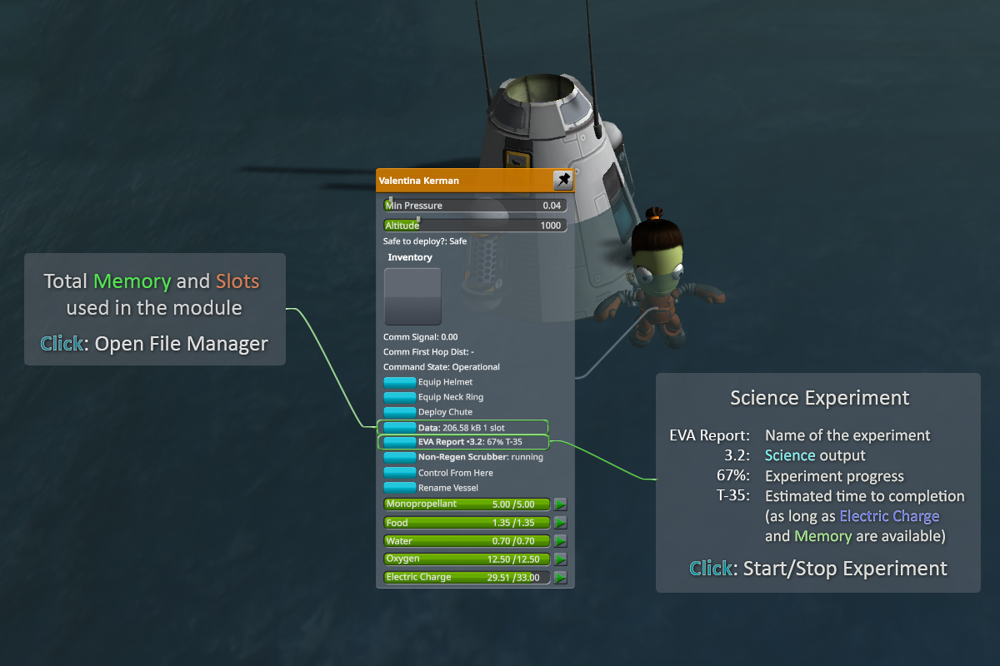
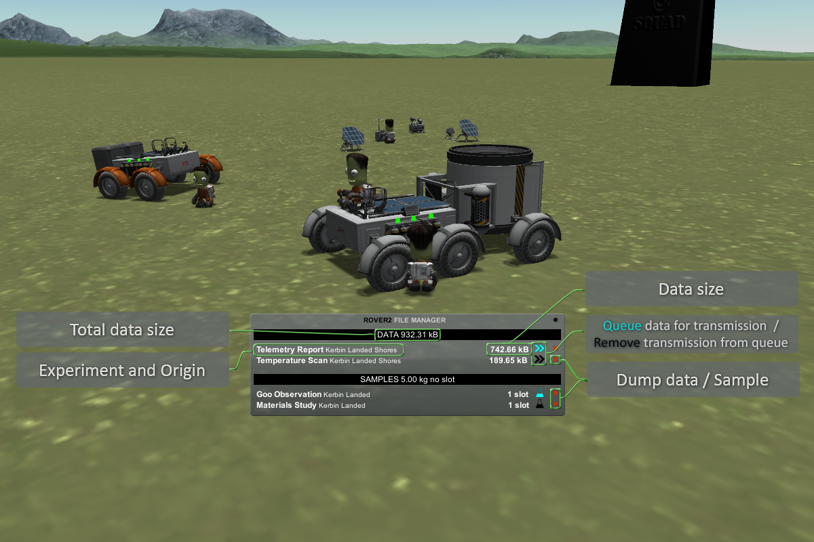

# Science in Kerbalism

Since the science overhaul (Kerbalism 3.x), science is not generated by a single button click anymore: experiments take time and planning, especially in career games.

Surface experiments from the Breaking Ground DLC are supported too.

As in real life, science doesn't come for free. Experiments use time, potentially a lot of time. They generate data that needs to be stored and transmitted, usually a lot of data. So much in fact, that during the later stages of your campaign it can literally take years to do and transmit a planet scan, even on low resolution!

[Kerbalism Science Tutorial on YouTube](https://www.youtube.com/watch?v=-M08C28HDrU)

## Science System

The principle is quite simple. Instead of completing right away, each experiment should be started, and it will complete over time if the conditions are good. Experiments can take a lot of time, some need years to complete. The good news is that once started, an experiment will automatically record data whenever it is scientifically valuable. And experiments will continue to do so even when it's not the currently active vessel. Put a probe in polar orbit for long enough, and it will run all experiments in all the biomes. It might be slow, but it is automatic. You don't even have to look at it.

There're two types of experiments:

* __Experiments that produce data straight away__. This data should be stored on the vessel's hard drives or can be transmitted straight away. __Examples__: Crew Report, Temperature Scan, Telemetry Report, etc.
* __Experiments that produce samples__. These samples have actual weight (that affects the vessel's mass) and should be stored for later analysis in a lab (or brought back home). __Examples__: Surface Sample, Mystery Goo observation, etc. 

For _data_ there should be enough hard drive space, while _samples_ should have free slots. Additionally, experiments should have a steady supply of Electric Charge so that the experiment may continue. 

 

## File Manager

The File Manager helps you manage science data and samples. With it, you can: 

* Review currently stored data and samples. 
* Toggle queue data for transmission (default on).
* Toggle mark samples for lab analysis (default on).
* Dump (destroy) unnecessary data and samples. 

Data transmission happens automatically, going through the queued data list top to bottom, provided there's an active connection to DSN.

## Communication Data Rates

Communication data rates are somewhere in the ballpark of reality, and that's a lot less than what you're used to. We know the data rates that NASA gets on Mars, Jupiter, and Pluto - and you will have similar data rates on Duna, Jool, and Eeloo. And they are... well, let's just say you better bring some buffer storage.

With the best antennas in the game and DSN at level 3, you'll see data rates from 500 Kb/s to 4 Mb/s on Duna (depending on how close it is to Kerbin). On Jool you'll get 38 Kb/s, while Eeloo will really test your patience at 2000 b/s. That's _bits_ per second, not bytes. In an early career game, you won't even be able to transmit data from Mun very quickly, and your SCANsat scans will take longer than what you're used to. _Much_ longer.

The good news is that data transmission is constant, permanent and works for all vessels, currently loaded or not. You can put a probe into Duna orbit and leave it there for years while you work other missions, it will constantly record and transfer science back to Kerbin.

## Data Storage

...is limited, and the cramped storage will haunt you throughout the game. As the game progresses, experiments will yield more scientific value, but also more data, and hard drive sizes will grow accordingly. Still, you'll have to transmit when you can, as much as you can. Very soon it won't be possible to do more than one or two experiments without having to transmit.

## Tips

* **Slow Down** As science takes time to collect it can be advisable to set your parachutes to open at the maximum altitude to allow enough time to complete science collection as you float slowly down.
* **Early Power** Experiments need electric charge. Your early pods don't have a lot of power so you need to invest early in other sources. Fuel cells are a great way of resolving your power issues until solar panels. Make them a priority.
* **Explore** It's not all about getting to space! At least not in your first few launches. Shores, Water and Grasslands are all within easy reach!
* **All The Science** With power in short supply you may have to pick and choose your experiments carefully. Don't expect to be able to put all science experiments on a single vessel.
* **Repeat, Repeat** Science takes time to complete, but it doesn't need to finish to get some science. If the experiment doesn't finish you can run it again next mission to pick up the science left behind.
* **Gonna Need a Bigger HDD** Different experiments produce different amounts of data and hard drives can fill up quickly. Make sure you're transmitting that data home! Antennas can be automated to respond to a full hard drive.
* **Transmitting...** Experiments produce data at different rates so ensure you have enough bandwidth to transmit it as quickly as you gather it or your hard drive will fill up fast. Choose the number and type of antennas wisely.
* **Unlimited Power!** You don't have it. Make sure you switch on your experiments (including those in the capsule) in the VAB and check the Kerbalism planner to see how much electrical power your vessel uses.
* **How Much?** Generally the longer it takes and the more electrical charge it uses the more science reward you'll get. Those difficult experiments are worth doing.
* **Automate** Just like everything else in Kerbalism those science experiments can be set to turn on and off depending on situation. Check the auto tab of the Kerbalism panel in flight.
* **Polar Orbits** You can run biome dependent experiments on a probe in polar orbit. That way your experiment will fly over all the biomes and collect data for all of them.