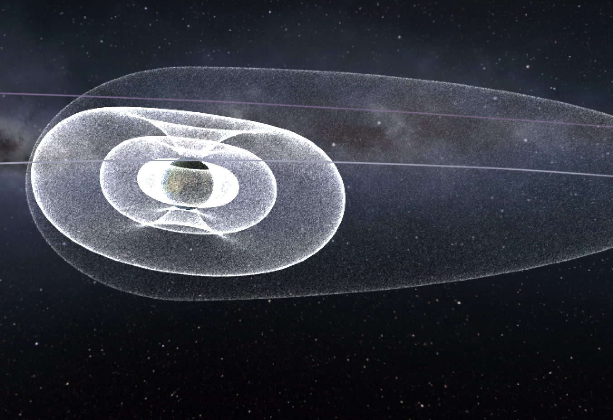

Demo video (radiation belts visualization): https://www.youtube.com/watch?v=CXmeSMBzf1c

## Modding Kerbalism's Radiation Model
A *RadiationModel* defines the signed distance function parameters that determine the shapes of the inner belt, outer belt and magnetopause. The model can be assigned to one or more celestial bodies using *RadiationBody*.

A belt is a torus with a distance, a radius and a deform_xy parameter. Distance defines the distance from the section center to the center of the body. The radius defines the size of the section. With deform_xy you can stretch or flatten the torus (1 is a perfect circle).
From that torus, you can substract another torus border, it has the same parameters.

Kerbins radiation belts, modelled on desmos.com:

* Inner belt: https://www.desmos.com/calculator/rxhsef6cxq
* Outer belt: https://www.desmos.com/calculator/ocj0mqx2m0

The magnetopause is simply a sphere, possibly deformed along the *body->star* vector to define a magnetotail.

All values are in body radii.

| PROPERTY | DESCRIPTION | DEFAULT |
| --- | --- | --- |
| name | Unique name for the radiation model |  |
| has_inner | True if the model has an inner radiation belt | false |
| inner_dist | Inner belt distance from body |  |
| inner_radius | "Thickness" of inner belt |  |
| inner_deform_xy | Deformation factor to flatten/stretch the belt along the rotation axis | 1.0 |
| inner_border_dist | Same as above for the border torus |  |
| inner_border_radius | "Thickness" of inner belt |  |
| inner_border_deform_xy | Deformation factor to flatten/stretch the belt along the rotation axis | 1.0 |
| inner_compression | Deform along the body-star vector, in direction of the star (dayside) | 1.0 |
| inner_extension | Deform along the body->star vector, in opposite direction of the star | 1.0 |
| inner_quality | Quality of border for rendering, influences pre-computation time | 30.0 |
| inner_deform | Deform the surface using a sum of sine waves | 0.0 |
| has_outer | True if the model has an outer radiation belt | false |
| outer_dist | see above |  |
| outer_radius | see above |  |
| outer_deform_xy | see above |  |
| outer_border_dist | see above |  |
| outer_border_radius | see above |  |
| outer_border_deform_xy | see above |  |
| outer_compression | see above |  |
| outer_extension | see above |  |
| outer_deform | see above |  |
| outer_quality | see above |  |
| has_pause | True if the model has a magnetopause | false |
| pause_radius | Magnetopause radius |  |
| pause_compression | Deform along the body->star vector, in direction of the star (dayside) | 1.0 |
| pause_extension | Deform along the body->star vector, in opposite direction of the star | 1.0 |
| pause_height_scale | Deform space along the magnetic axis vector | 1.0 |
| pause_deform | Deform the surface using a sum of sine waves | 0.0 |
| pause_quality | Quality of border for rendering, influences pre-computation time | 20.0 |

## Radiation Body
The *RadiationBody* associates a *RadiationModel* to a celestial body and defines the radiation contribution inside the zones delimited by the signed distance function. Radiation values in a zone can be negative, that is usually the case for a magnetopause's contribution.

| PROPERTY | DESCRIPTION | DEFAULT |
| --- | --- | --- |
| name | Name of the celestial body |  |
| model | Name of the *RadiationModel* associated |  |
| radiation_inner | Radiation contribution inside the inner belt, in rad/h |  |
| radiation_inner_gradient | Defines how fast radiation goes up when entering the belt | 3.3 |
| radiation_outer | Radiation contribution inside the outer belt, in rad/h |  |
| radiation_outer_gradient | Defines how fast radiation goes up when entering the belt | 2.2 |
| radiation_pause | Radiation contribution inside the magnetopause, in rad/h |  |
| reference | Index of the body used to determine field orientation | the Sun |
| geomagnetic_pole_lat | Latitude of the geomagnetic north pole on the surface | 90.0 |
| geomagnetic_pole_lon | Longitude of the geomagnetic north pole on the surface | 0.0 |
| geomagnetic_offset | Offset of the geomagnetic field from the center of the body | 0.0 |
|  | along the axis of the geomagnetic field (in body radius) |  |
| radiation_surface | Radiation emitted on the surface of the body, in rad/h | 0.0 |
| solar_cycle | Duration of the radiation activity cycle | 0.0 |

Radiation is *computed* at a point by walking the *body chain* and summing all contributions for that point from all the fields overlapping with that point. When the top of the chain is reached the radiation value parameter *ExternRadiation* from the settings_ file is added.

Using `geomagnetic_pole_lat`, `geomagnetic_pole_lon` and `geomagnetic_offset` it is possible to create rather interesting radiation field configurations ()

`radiation_inner_gradient` and `radiation_outer_gradient` determine how fast the radiation rises on the way towards the center of the radiation field.  Lower value = slow increase. This value is used in combination with the nearest distance to the field boundary, which means that values smaller than 1 will result in fields that don't have the full strength in their center. Depending on the form of the belt, you will need values higher than 1.

`radiation_surface` is calculated to all visible bodies and decreases with distance, following the inverse square law.

`solar_cycle` defines the lenght of the interval with varying degrees of solar activity. Our (real) sun has a cycle of 11 years during which the frequency and intensity of coronal mass ejection (CME) events vary to some degree. Kerbalism uses a pseudo-erratic function (https://www.desmos.com/calculator/tyuqgdk4jh) to calculate a sun activity value for any given point in time, which is used to increase or decrease frequency and intensity of storms as well as the intensity of the surface radiation of a sun.
