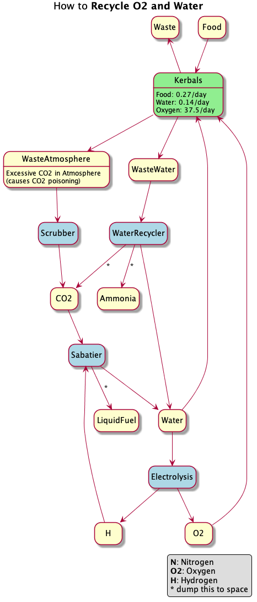
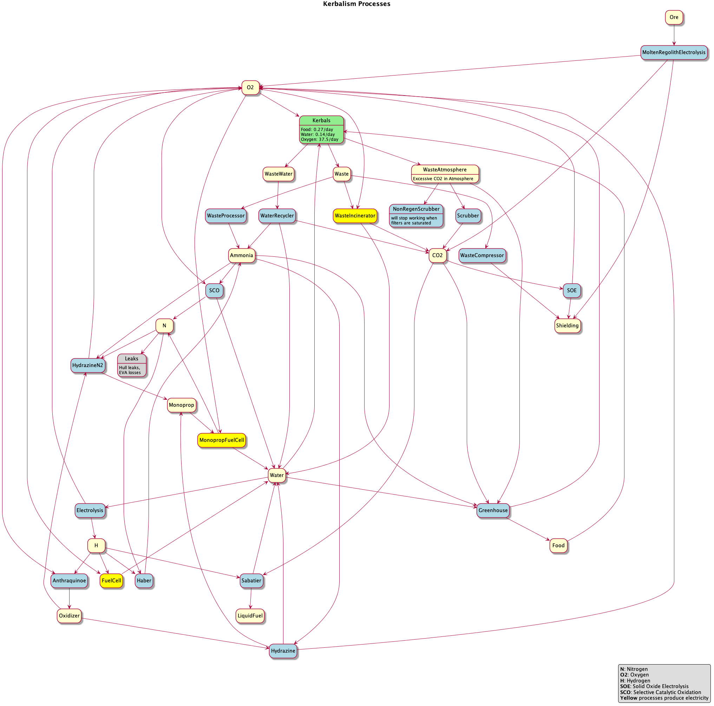

.. _tutorial:

So, you're about to go to Mun?
==============================

Kerbalism adds about six new ways to get your crew killed. If this is your first attempt at Mun with Kerbalism, read this tutorial or bring some body bags. You have been warned.

Before you go...
----------------

Let's assume you've just started a new career game and are about to do your first missions to Mun. You didn't expand your VAB or launch pad, so you're limited to vessels with a maximum of 30 parts and 18 tons. A crewed mission to Mun isn't trivial under these circumstances, and with Kerbalism it's going to be a new challenge, even if you've done many missions to Mun in earlier games.

In order to survive with Kerbalism, Kerbals need enough food, water and oxygen for the duration of the entire mission. Command pods contain enough of these to last for 5 days, which is just enough for a quick trip to Mun, like a flyby or a touch and go landing. Anything beyond that will require additional supplies, so stick to Mun - and Mun only. Do not stay for more than a few hours. And don't even think about Minmus, not yet. Any deviation from that will get your crew killed for a number of reasons, starvation just being one of them.

The most important resource on any crewed vessel, after oxygen, is electricity. Without electricity, your crew will suffocate, freeze or burn to death, whichever kills them first. Not having any food left won't be your number one problem when climatization fails and you're about to burn up in the sun. So, let's take care of that first.

Minimum requirements
--------------------

You need a reliable method to generate electricity. If you haven't researched solar panels or fuel cell generators yet, go ahead and do that first. You won't survive a trip to Mun without a way to generate electricity.

If at all possible, don't rely on solar panels only, bring a fuel cell. As a general rule, fuel cells will keep your Kerbals alive, so get into the habit of using them early. The thing about solar panels is that they need to see the sun, and all of your missions will spend a lot of time in shadow.

Ship construction
-----------------

If you're going with fuel cells (recommended), attach a H2+O2 (Hydrogen+Oxygen) fuel cell generator to your ship. Also attach a small pressurized tank that contains Hydrogen (by default, pressurized tanks contain oxygen, so make sure to configure it in the VAB), and if you can an extra tank for Oxygen. The fuel cell will consume hydrogen and oxygen while it runs, which might leave your kerbals with no O2 left to breahte. Solar panels will reduce the consumption of H2 and O2.

While a H2+O2 fuel cell is running, it also produces some water. Kerbalism won't run any process if the output of that process cannot be stored or dumped, so set your fuel cell to dump the water that cannot be stored. You can do that in flight, so don't panic if you forgot to do that in the VAB. Excess water won't be a problem later since your crew will be drinking it.

Other than that, you can build your vessel just like you did without Kerbalism. However, do not add any shielding to your command pod. You won't need it for Mun as the trip there is very short, and a fully shielded pod has its own issues. For instance, it won't float on water.

Launch window
-------------

If you don't have a fuel cell, don't launch unless you're certain that Mun will not pass through Kerbins shadow while you're up there. At the beginning of a new game, Mun is just about to pass behind Kerbin - so wait a couple of days before you launch. Otherwise your crew will freeze in the shadow.

Just before launch
------------------

If you have a fuel cell, you probably don't want it to be running all the time. Kerbalism comes with an on board device manager that can turn on your fuel cell when your batteries are empty, and turn it back off when your batteries are charged. Doing that will save you a lot of Hydrogen and Oxygen, especially when you also have solar panels that recharge your batteries.

What's next?
------------

Launch! Fingers crossed, you'll make it back from Mun before you run out of oxygen, food, water, electricity or hydrogen.

Notice how humidity in your command pod rises throughout your trip. Remember all the water your crew is drinking? It's dripping from your instrument panels now. Not an ideal situation, but for a short trip not a reason of concern. However, for longer missions you will need extra ECLSS units with humidity controllers.

Your next steps will be towards Minmus, which takes considerably longer. Make sure to bring provisions for about 20 days, and bring a humidity controller this time. You will need it.

How to recycle O2 and Water
==============================

You can recycle O2 and water using Kerbalisms life support systems and chemical processors. Follow this guideline to extend your mission durations indefinitely and save literally tons of mass you don't have to bring on your journeys.

1. Add a small tank for waste water.
2. Have a water recycler in one of your life support units, set it to dump excessive CO2 and Ammonia.
3. Add a small tank for hydrogen and a small tank for CO2. They can be empty, but I'd fill up the hydrogen.
4. Have a chemical plant running a Sabatier process. Set that to dump any excessive liquid fuel.
5. Have a chemical plant running Water Electrolysis.

While this method is highly effective in reducing the mass of your vessel, it also is very risky. You now have 3 components that can break down, and if any one of them cannot be repaired, your crew will use up what little O2 is stored in the tanks and then die. So think about redundancy when using this method!

You can do more...
------------------

There are many processes available in Kerbalism, and you can do any number of things with them. This chart will help you navigate the various processes and resources.

